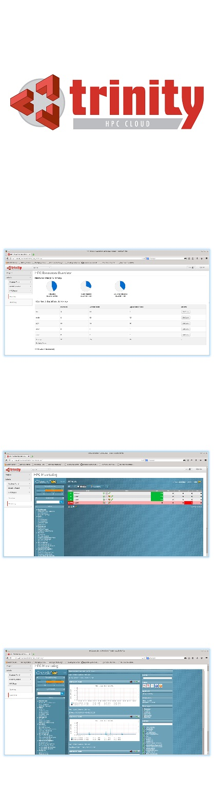

= Trinity 

== Tell me more about Trinity!

*Trinity* is an open source software platform which provides *HPC as a
Service*. *Trinity* is a private HPC Cloud solution, engineered for *high
performance computing*. It provides a *complete HPC cluster manager* on
top of a cloud platform capable of managing HPC, general IT, and Big
Data.

*Trinity* brings the flexibility of Platform-as-a-Service to HPC. With it, you
can give your users access to virtual HPC clusters, all managed from inside
your http://www.openstack.org/[OpenStack]® dashboard.

*Trinity* was designed to solve an impedance mismatch between Cloud and HPC. A
typical cloud infrastructure (e.g. OpenStack) has no (physical) provisioning
tools. Traditional virtualization (based on e.g., KVM ) imposes a performance
hit, which often makes it unacceptable for HPC applications. Virtual machines
provided by typical cloud infrastructures come with generic hardware and
software stacks, whereas HPC applications usually run on specialized hardware
(GPU, IB) and software stacks (MPI, compilers, modules environment).

== Features

Power of HPC

 * Scalable to tens of thousands of nodes
 * Full hardware support (IPMI, Infiniband, PXE)
 * Complete HPC stack (job schedulers, MPI & scientific libraries, compilers, profilers, debuggers)
 * Scheduler - SLURM
 * MPI libraries - OpenMPI, Intel MPI, MVAPICH, MPICH2
 * Compilers - GNU and Intel
 * No performance loss (http://www.docker.com/[Docker] based containerization)
 * Load balancing (HPC) partitions

Agility of the Cloud

 * Full control of environment customization for users with different requirements
 * Ease of management and usage metering (Trinity dashboard)
 * Allows customers to host their own private or public IaaS cloud (for general IT, selling cycles)
 * Ability to re-partition the cluster according to current internal demands

== FAQ

_I want to do High Performance Computing, why should I be interested in a cloud solution?_

A cloud like environment has many attractive features which are missing in a
traditional, static HPC environment, such as:

 * *Data isolation*: Usually, in HPC, simulation data output is written on a
world-readable fast storage space (scratch). This situation may not always be
desirable, i.e. in the life-sciences field where access to genomic data needs
to be restricted to specific researchers. With Trinity, the output from each
HPC application will be written to isolated containers, accessible only to the
owners of the HPC application.
 * *Data reproducibility*: Data reproducibility is extremely important for any
research effort. With Trinity, users can not only save their input files, but
the whole HPC stack, both the runtime environment and private software stacks,
which helps reproduce the data reliably at any time.
 * *Workspace flexibility*: Research groups used to code development with a
specific software environment (operating system, libraries, packages,
compilers) may need to change their workflow to adapt to the cluster’s
environment when they are ready to scale-up their codes. With Trinity, the
transition is much smoother, as they customize their allocated cluster nodes to
fit their familiar workflow.

_I like the idea of cloud computing, but why not buy cycles from a public cloud provider?_

 * *Data security*: On a public cloud, there is simply no guarantee that your data is secure.
 * *HPC needs*: An HPC cluster has many hardware and software features that are
in general absent from garden-variety public clouds. These can only be provided
by a private cloud environment like Trinity, customized to provide full HPC
support.

_It looks like the cloud is all about virtualization; doesn’t that affect performance?_

A standard Openstack installation will indeed use virtual machines to setup a
computer environment. However, in Trinity, we use Docker containers, which
provide lightweight virtualization (compared to traditional hypervisors like
KVM). The performance of Docker containers for tasks essential to HPC (FLOPS,
I/O, memory and network) is far superior to traditional virtual machines, and
nearly identical to running on “bare metal”.

'''

Bridging the gap between OpenStack® and HPC
